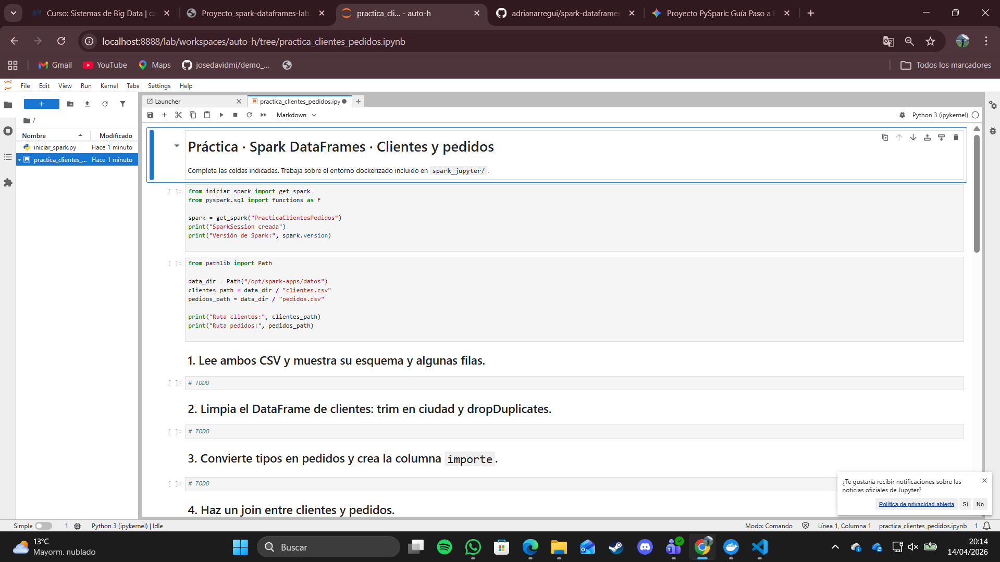
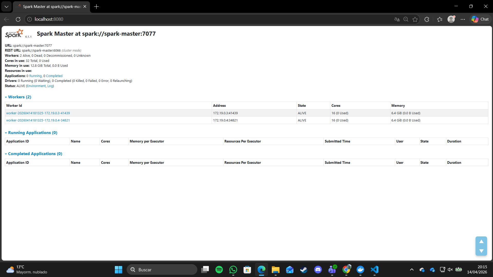
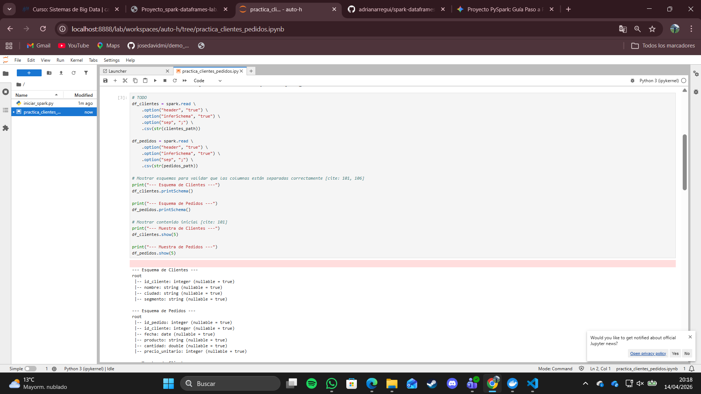
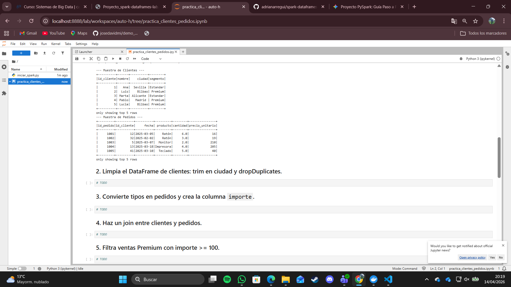
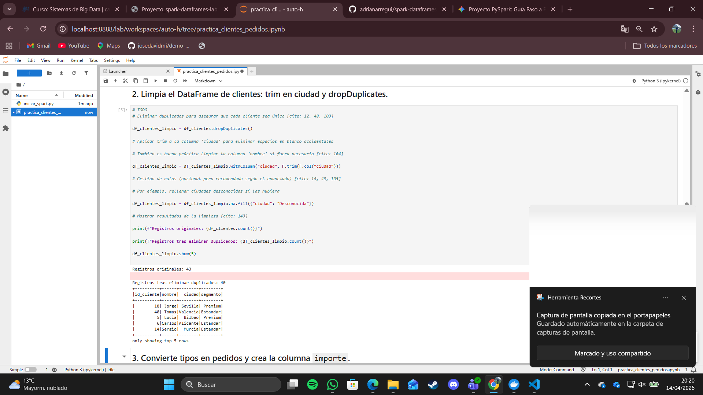
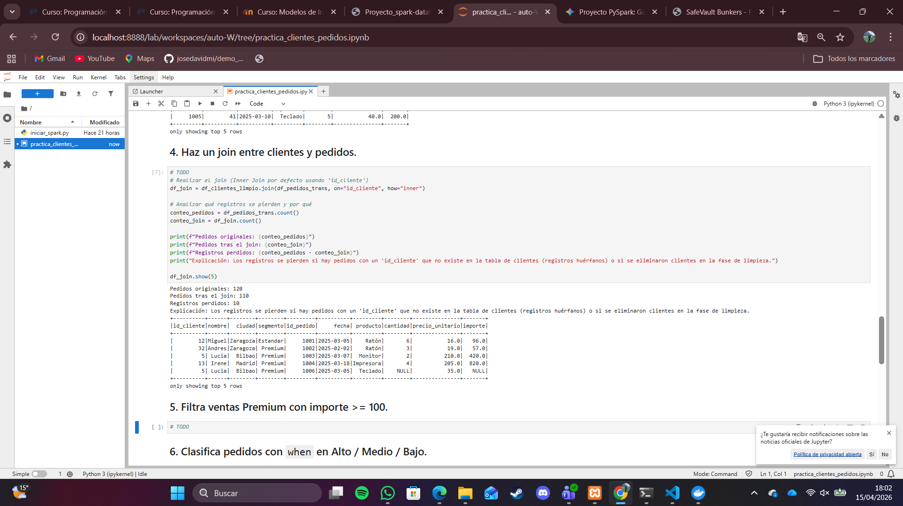

# Evidencias de la práctica

Incluye aquí capturas o salidas relevantes del cuaderno.

## 1. Entorno levantado
- Captura de JupyterLab 
- Captura del Spark Master UI 

## 2. Lectura de datos
- Esquema de `clientes`
- Esquema de `pedidos`

- Muestra inicial de datos 

## 3. Limpieza
- Resultado tras `trim`
- Eliminación de duplicados
- Tratamiento de valores nulos

## 4. Join
- Resultado del join entre clientes y pedidos
- Explicación breve de los registros perdidos

## 5. Agregaciones
- Resumen por ciudad y segmento
- Interpretación breve de los resultados

## 6. SQL
- Consulta SQL realizada
- Resultado obtenido

## 7. Parquet
- Escritura del resultado
- Lectura posterior del fichero Parquet
